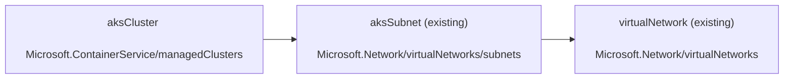

## Graph

## Parameters

| Name | Type | Description |
| -- | -- | -- |
| [`location`](./aks.bicep#L1C1-L2C49) | `string` | Specifies the location of AKS cluster. |
| [`aksClusterName`](./aks.bicep#L4C1-L5C72) | `string` | Specifies the name of the AKS cluster. |
| [`aksClusterDnsPrefix`](./aks.bicep#L7C1-L8C50) | `string` | Specifies the DNS prefix specified when creating the managed cluster. |
| [`aksClusterTags`](./aks.bicep#L10C1-L14C2) | `object` | Specifies the tags of the AKS cluster. |
| [`aksClusterNetworkPlugin`](./aks.bicep#L16C1-L21C47) | `string` | Specifies the network plugin used for building Kubernetes network. - azure or kubenet. |
| [`aksClusterNetworkPolicy`](./aks.bicep#L23C1-L28C47) | `string` | Specifies the network policy used for building Kubernetes network. - calico or azure |
| [`aksClusterPodCidr`](./aks.bicep#L30C1-L31C49) | `string` | Specifies the CIDR notation IP range from which to assign pod IPs when kubenet is used. |
| [`aksClusterServiceCidr`](./aks.bicep#L33C1-L34C51) | `string` | A CIDR notation IP range from which to assign service cluster IPs. It must not overlap with any Subnet IP ranges. |
| [`aksClusterDnsServiceIP`](./aks.bicep#L36C1-L37C50) | `string` | Specifies the IP address assigned to the Kubernetes DNS service. It must be within the Kubernetes service address range specified in serviceCidr. |
| [`aksClusterDockerBridgeCidr`](./aks.bicep#L39C1-L40C58) | `string` | Specifies the CIDR notation IP range assigned to the Docker bridge network. It must not overlap with any Subnet IP ranges or the Kubernetes service address range. |
| [`aksClusterLoadBalancerSku`](./aks.bicep#L42C1-L47C52) | `string` | Specifies the sku of the load balancer used by the virtual machine scale sets used by nodepools. |
| [`aksClusterSkuTier`](./aks.bicep#L49C1-L54C40) | `string` | Specifies the tier of a managed cluster SKU: Paid or Free |
| [`aksClusterKubernetesVersion`](./aks.bicep#L56C1-L57C52) | `string` | Specifies the version of Kubernetes specified when creating the managed cluster. |
| [`aksClusterAdminUsername`](./aks.bicep#L59C1-L60C37) | `string` | Specifies the administrator username of Linux virtual machines. |
| [`aksClusterSshPublicKey`](./aks.bicep#L62C1-L63C36) | `string` | Specifies the SSH RSA public key string for the Linux nodes. |
| [`aadEnabled`](./aks.bicep#L65C1-L66C30) | `bool` | Specifies whether enabling AAD integration. |
| [`aadProfileTenantId`](./aks.bicep#L68C1-L69C58) | `string` | Specifies the tenant id of the Azure Active Directory used by the AKS cluster for authentication. |
| [`aadProfileAdminGroupObjectIDs`](./aks.bicep#L71C1-L72C47) | `array` | Specifies the AAD group object IDs that will have admin role of the cluster. |
| [`aksClusterEnablePrivateCluster`](./aks.bicep#L74C1-L75C49) | `bool` | Specifies whether to create the cluster as a private cluster or not. |
| [`aadProfileManaged`](./aks.bicep#L77C1-L78C37) | `bool` | Specifies whether to enable managed AAD integration. |
| [`aadProfileEnableAzureRBAC`](./aks.bicep#L80C1-L81C45) | `bool` | Specifies whether to  to enable Azure RBAC for Kubernetes authorization. |
| [`nodePoolName`](./aks.bicep#L83C1-L84C40) | `string` | Specifies the unique name of the node pool profile in the context of the subscription and resource group. |
| [`nodePoolVmSize`](./aks.bicep#L86C1-L87C48) | `string` | Specifies the vm size of nodes in the node pool. |
| [`nodePoolOsDiskSizeGB`](./aks.bicep#L89C1-L90C37) | `int` | Specifies the OS Disk Size in GB to be used to specify the disk size for every machine in this master/agent pool. If you specify 0, it will apply the default osDisk size according to the vmSize specified.. |
| [`nodePoolCount`](./aks.bicep#L92C1-L93C28) | `int` | Specifies the number of agents (VMs) to host docker containers. Allowed values must be in the range of 1 to 100 (inclusive). The default value is 1. |
| [`nodePoolOsType`](./aks.bicep#L95C1-L100C38) | `string` | Specifies the OS type for the vms in the node pool. Choose from Linux and Windows. Default to Linux. |
| [`nodePoolMaxPods`](./aks.bicep#L102C1-L103C31) | `int` | Specifies the maximum number of pods that can run on a node. The maximum number of pods per node in an AKS cluster is 250. The default maximum number of pods per node varies between kubenet and Azure CNI networking, and the method of cluster deployment. |
| [`nodePoolMaxCount`](./aks.bicep#L105C1-L106C31) | `int` | Specifies the maximum number of nodes for auto-scaling for the node pool. |
| [`nodePoolMinCount`](./aks.bicep#L108C1-L109C31) | `int` | Specifies the minimum number of nodes for auto-scaling for the node pool. |
| [`nodePoolEnableAutoScaling`](./aks.bicep#L111C1-L112C44) | `bool` | Specifies whether to enable auto-scaling for the node pool. |
| [`nodePoolScaleSetPriority`](./aks.bicep#L114C1-L119C50) | `string` | Specifies the virtual machine scale set priority: Spot or Regular. |
| [`nodePoolNodeLabels`](./aks.bicep#L121C1-L122C37) | `object` | Specifies the Agent pool node labels to be persisted across all nodes in agent pool. |
| [`nodePoolNodeTaints`](./aks.bicep#L124C1-L125C36) | `array` | Specifies the taints added to new nodes during node pool create and scale. For example, key=value:NoSchedule. - string |
| [`nodePoolMode`](./aks.bicep#L127C1-L132C37) | `string` | Specifies the mode of an agent pool: System or User |
| [`nodePoolType`](./aks.bicep#L134C1-L139C54) | `string` | Specifies the type of a node pool: VirtualMachineScaleSets or AvailabilitySet |
| [`nodePoolAvailabilityZones`](./aks.bicep#L141C1-L142C43) | `array` | Specifies the availability zones for nodes. Requirese the use of VirtualMachineScaleSets as node pool type. |
| [`virtualNetworkId`](./aks.bicep#L144C1-L145C30) | `string` | Specifies the id of the virtual network. |
| [`aksSubnetName`](./aks.bicep#L147C1-L148C41) | `string` | Specifies the name of the default subnet hosting the AKS cluster. |
| [`logAnalyticsWorkspaceId`](./aks.bicep#L150C1-L151C37) | `string` | Specifies the name of the Log Analytics Workspace. |

